# AI-Powered Contract & Legal Document Risk Analyzer

A production-oriented AI system that ingests contracts (PDF/DOCX/TXT, including scanned
PDFs via OCR), extracts key clauses and metadata, detects and explains risks with confidence
scores, generates an executive summary, supports natural-language semantic search / RAG Q&A
over the document, computes an AI compliance score, and exports full risk-assessment reports as
PDF or DOCX — behind a role-based auth system with an admin panel for usage monitoring.

Built for TEYZIX internship task **AI-3**.

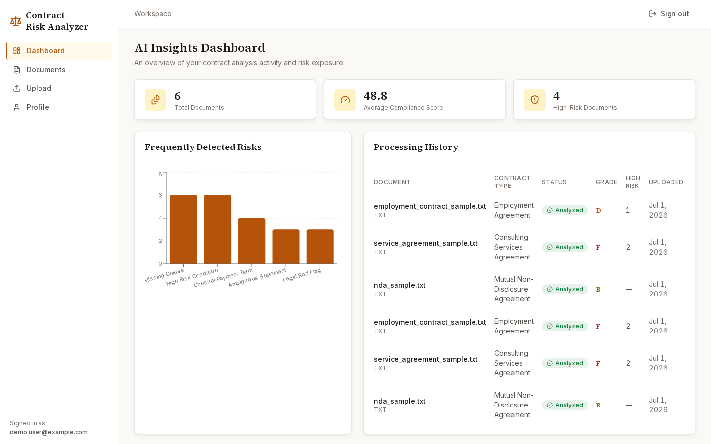

## Feature checklist (mandatory spec)

- [x] Secure auth — registration, login (JWT), role-based access (admin/user), profile management
- [x] Document upload — PDF / DOCX / TXT, validated (extension + size + magic bytes) before processing
- [x] AI document analysis — contract type, parties, effective/expiry dates, payment terms, renewal/confidentiality/termination clauses, responsibilities
- [x] Risk detection — missing clauses, high-risk conditions, ambiguous statements, unusual payment terms, legal red flags — each with a confidence score and plain-English explanation
- [x] AI summary — executive summary, key obligations, important dates, important clauses, recommended actions
- [x] Semantic search — natural-language queries over a document's clauses
- [x] AI Insights Dashboard — total documents, average compliance score, high-risk count, frequent risk types, processing history
- [x] Report generation — PDF (reportlab) and DOCX (python-docx) exports with risk assessment, summary, clause analysis, recommendations
- [x] Document history — every processing run is preserved (reprocessing appends, never overwrites)
- [x] Admin panel — manage users, view processing stats, monitor AI (Groq) usage, manage any user's documents, review system/audit logs

### Bonus features implemented

- [x] **RAG-based Question Answering** — the same semantic-search endpoint grounds an AI-generated answer in retrieved excerpts (`mode=answer`), and refuses to guess when the excerpts are insufficient
- [x] **OCR for scanned documents** — Tesseract (`pytesseract` + `pdf2image`) kicks in automatically when a PDF has no usable text layer; the UI flags OCR-derived text for manual verification
- [x] **AI Compliance Score** — a deterministic, explainable weighted aggregate of risk severities × confidences (see `docs/ai_workflow.md`)
- [x] **Docker deployment** — `docker-compose.yml` for backend + frontend

## Tech stack

| Layer | Choice |
|---|---|
| Backend | Python 3.11+, FastAPI, async throughout, class-based services, custom exception hierarchy |
| Database | SQLite + SQLAlchemy 2.0 (async, `aiosqlite`) |
| LLM | Groq API — `llama-3.3-70b-versatile` (extraction/risk), `llama-3.1-8b-instant` (summary/RAG) |
| Embeddings / Vector search | `sentence-transformers` (`all-MiniLM-L6-v2`, local, CPU) + ChromaDB |
| Document parsing | `pdfplumber`, `python-docx`, `pytesseract` + `pdf2image` (OCR fallback) |
| Reports | `reportlab` (PDF), `python-docx` (DOCX) |
| Auth | JWT (`python-jose`) + bcrypt (`passlib`) |
| Frontend | Next.js 15 (App Router), TypeScript, Tailwind CSS v4, Recharts, Radix UI primitives |

## Screenshots

| | |
|---|---|
| 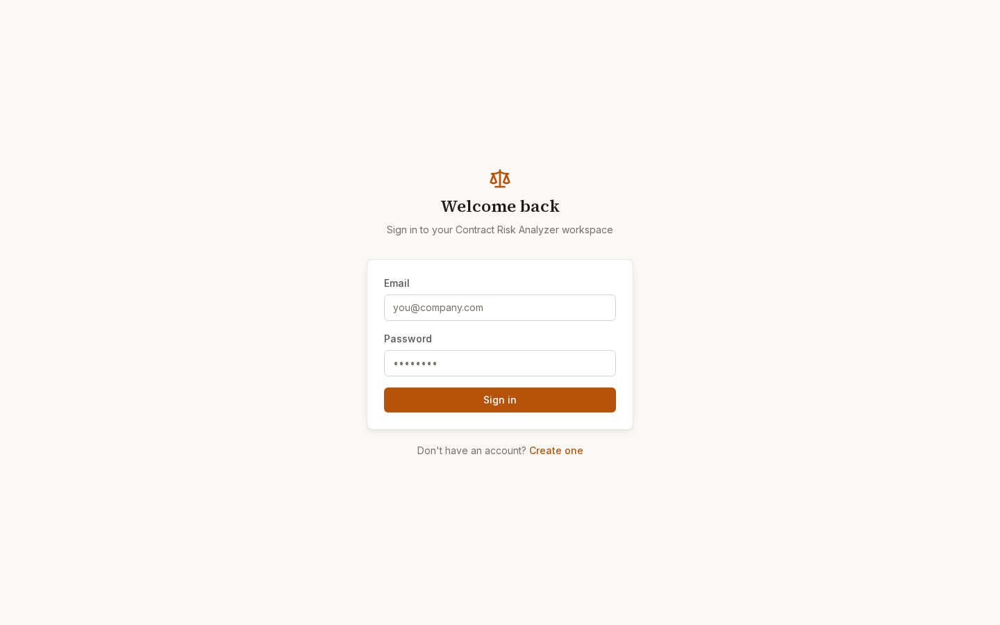 | 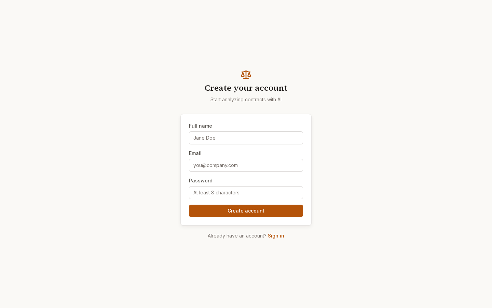 |
| 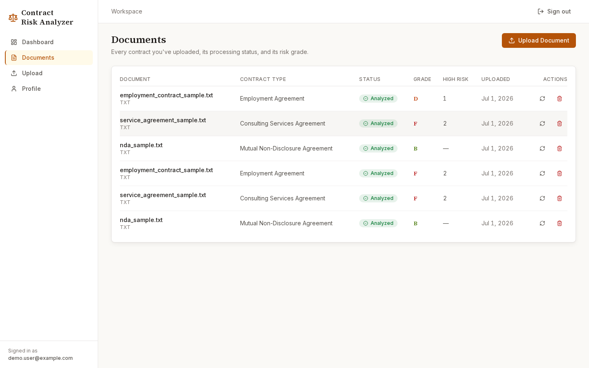 | 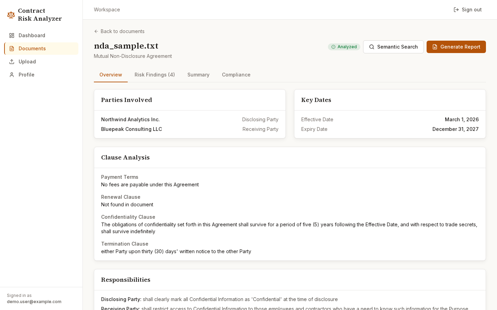 |
| 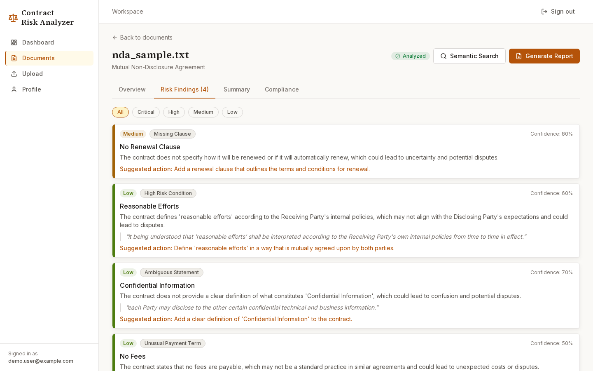 | 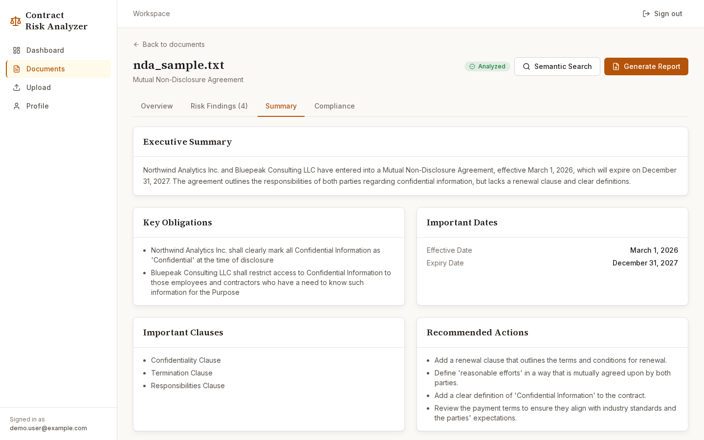 |
| 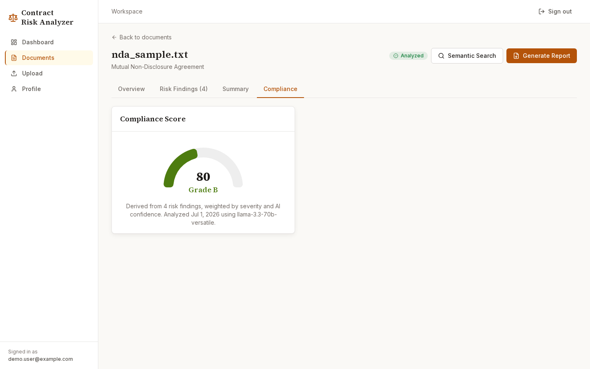 | 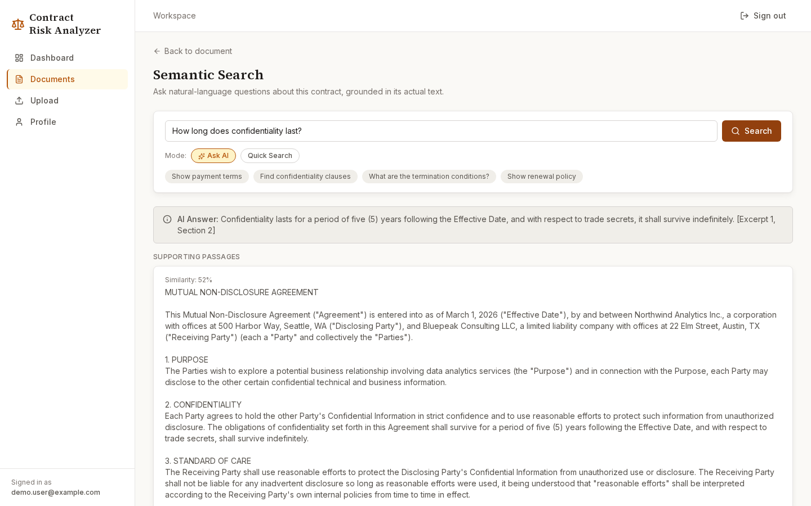 |
| 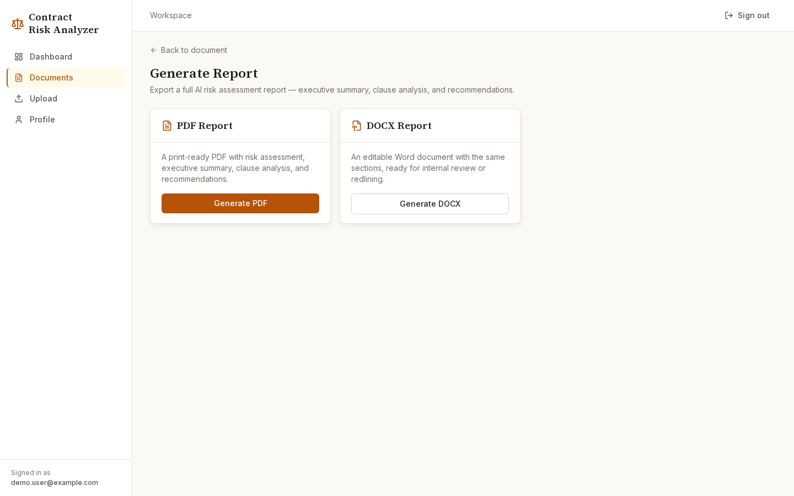 | 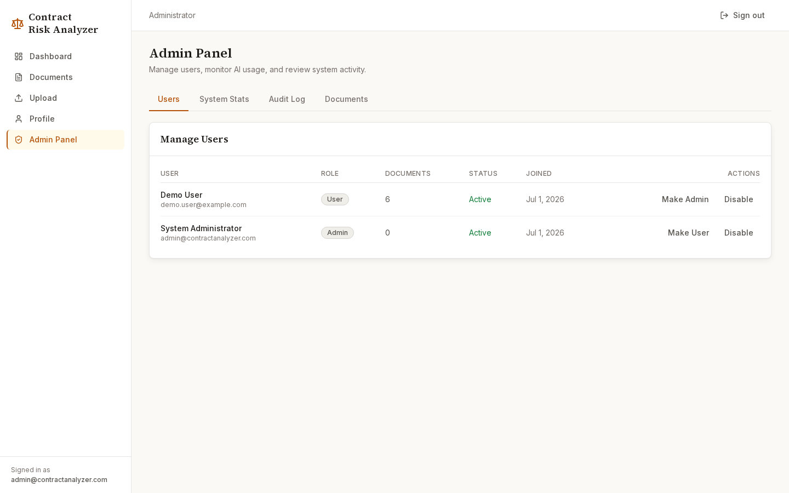 |

## Design

"Charcoal & Amber" — a warm-neutral, legal-tech visual identity built deliberately to avoid the
generic blue-SaaS look: a stone-toned neutral palette, a single amber/gold accent, a serif
display font (Source Serif 4) paired with Inter for body text, and severity colors distinct
from the brand accent (critical red, high orange, medium muted gold, low olive).

## Architecture & AI workflow

See [`docs/architecture.md`](docs/architecture.md) for the component diagram and request
lifecycle, [`docs/ai_workflow.md`](docs/ai_workflow.md) for the full prompt design and
per-stage failure/degradation behavior, [`docs/database_schema.md`](docs/database_schema.md)
for the ERD, and [`docs/api_reference.md`](docs/api_reference.md) for the full endpoint list.

In short, uploading a document triggers a 7-stage async pipeline (`DocumentProcessingPipeline`):
**parse → chunk/embed/index → extract → detect risk → summarize → score → persist**, where every
stage catches its own failures and degrades gracefully (a document always lands in a terminal,
queryable status — `analyzed`, `partial`, or `failed` — never stuck in `processing`).

## Setup

### Prerequisites

- Python 3.11+
- Node.js 20+
- Tesseract OCR + Poppler (for the OCR fallback path): `sudo apt install tesseract-ocr poppler-utils` (Debian/Ubuntu/Kali)
- A [Groq API key](https://console.groq.com/keys) (free tier is sufficient)

### Backend

```bash
cd backend
python3 -m venv .venv
source .venv/bin/activate

# IMPORTANT — install CPU-only torch FIRST. sentence-transformers depends on torch, and if
# you skip this step pip will resolve the default GPU/CUDA build, which is ~4GB+ of unneeded
# CUDA packages on a machine with no GPU. This one command avoids that entirely:
pip install torch --index-url https://download.pytorch.org/whl/cpu
pip install -r requirements.txt

cp .env.example .env
# edit .env and set GROQ_API_KEY (and optionally JWT_SECRET_KEY, ADMIN_EMAIL/ADMIN_PASSWORD)

uvicorn app.main:app --reload
# -> http://localhost:8000  (Swagger docs at /docs)
```

A bootstrap admin account is created automatically on first startup from the `ADMIN_EMAIL` /
`ADMIN_PASSWORD` env vars (defaults: `admin@example.com` / `ChangeMe123!` — change these).

### Frontend

```bash
cd frontend
npm install
cp .env.local.example .env.local   # NEXT_PUBLIC_API_URL=http://localhost:8000
npm run dev
# -> http://localhost:3000
```

### Running tests

```bash
cd backend
source .venv/bin/activate
pytest    # 23 tests: auth, upload validation, compliance scoring, report generation,
          # full pipeline run with a mocked Groq client (fast, free, deterministic)
```

### Docker

```bash
cp backend/.env.example backend/.env   # set GROQ_API_KEY, etc.
docker-compose up --build
# frontend -> http://localhost:3000, backend -> http://localhost:8000
```

The backend image installs `tesseract-ocr` + `poppler-utils` via `apt` and the CPU-only torch
wheel — both are easy to forget when containerizing this kind of pipeline, so they're baked
into `backend/Dockerfile` directly. Client-side (browser) fetches need the **host-reachable**
API URL, not the internal Docker service DNS name — `docker-compose.yml` documents this via the
`NEXT_PUBLIC_API_URL` build arg.

## Sample documents

Three hand-authored fixtures live in [`samples/`](samples/), each engineered to reliably
trigger specific risk categories so the pipeline's output is easy to sanity-check:

- **`nda_sample.txt`** — mutual NDA with a vague "reasonable efforts" clause (→ ambiguous
  statement) and a long confidentiality survival term (→ high-risk condition)
- **`service_agreement_sample.txt`** — consulting agreement with a 90-day payment term (→
  unusual payment term) and a missing renewal clause (→ missing clause)
- **`employment_contract_sample.txt`** — employment contract with a worldwide, indefinite
  non-compete (→ legal red flag)

Upload any of them from the **Upload Document** page to see the full pipeline run end-to-end.

## Local OCR model recommendation

This project targets machines without a dedicated GPU (the reference dev machine: Intel Core
i7-8550U, integrated UHD 620 graphics, no CUDA, 32GB RAM). For that profile:

- **Tesseract OCR** (implemented here, via `pytesseract` + `pdf2image`) — lightest and fastest
  on CPU, good accuracy on clean scanned contracts. Only invoked as a fallback when a PDF has no
  extractable text layer, so text-layer PDFs never pay the OCR cost.
- **RapidOCR** (ONNXRuntime, CPU build) — the natural upgrade path if Tesseract's accuracy proves
  insufficient on noisier/rotated scans: still CPU-only, small models (~10–15MB), and it's the
  engine [Docling](https://github.com/docling-project/docling) uses by default when paired with
  a local LLM/RAG pipeline for automated contract review — a good fit if this project is later
  extended toward fully local (no external API) operation.
- **Avoid** GPU-oriented options (EasyOCR's default weights, PaddleOCR's GPU builds, Surya's
  heavier configs) on hardware like this — they gain little without CUDA and add meaningful
  latency.

## Known limitations

- **SQLite single-writer**: mitigated with WAL mode and short-lived sessions; a real
  multi-tenant deployment should move to Postgres (one `DATABASE_URL` change — SQLAlchemy async
  already abstracts the driver).
- **In-process background tasks**: not crash-safe if the server restarts mid-analysis; a
  startup sweep marks any interrupted document as `failed` (reprocessable) rather than silently
  losing it. A production deployment should use a real task queue (Celery/RQ + Redis).
- **Groq JSON-mode reliability**: not schema-enforced by the API — mitigated with Pydantic
  validation + one repair retry + documented per-stage degradation (see `docs/ai_workflow.md`).
- **Tesseract OCR accuracy**: no layout/table understanding; documents that used OCR are flagged
  in the UI for manual verification.
- **Auth token storage**: the access token is kept in `localStorage` rather than an httpOnly
  cookie, trading some XSS-hardening for a much simpler client (no Next.js API-route proxy for
  every request). Documented here as the honest tradeoff, not hidden.

## Project structure

```
task 3/
  backend/            FastAPI app (see backend/app/ for models/schemas/api/services)
  frontend/            Next.js 15 app
  samples/              Sample legal documents for testing
  screenshots/           Captured UI screenshots
  docs/                   Architecture, AI workflow, API reference, DB schema
  docker-compose.yml
```
