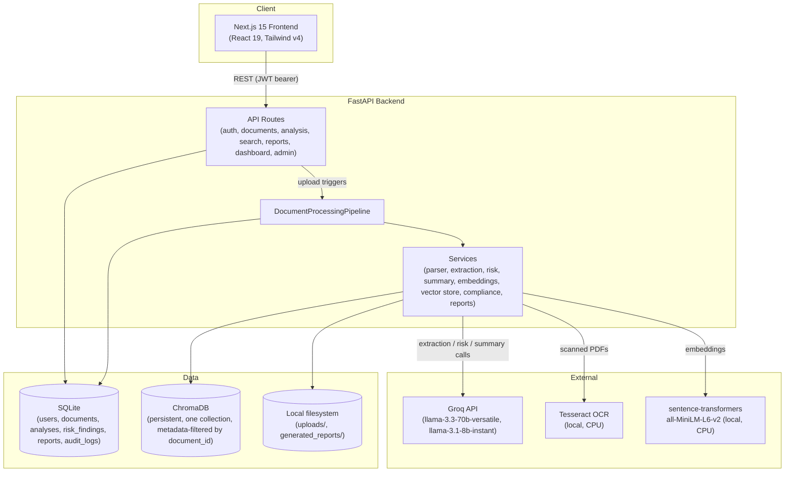
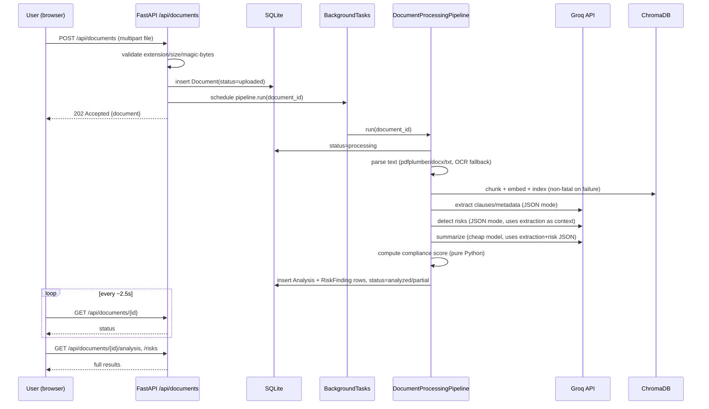

# Architecture

## Component overview

## Request lifecycle: upload → analyzed

## Why these choices

- **SQLite over Postgres**: zero external infra for a local/demo-scoped deployment. Mitigated single-writer limitation with WAL mode + short-lived sessions + one pipeline run at a time. Documented as a scaling limitation, not fixed here — swapping `DATABASE_URL` to a Postgres DSN is the only change needed if concurrency ever matters (SQLAlchemy async already abstracts the driver).
- **In-process `BackgroundTasks` over a task queue**: FastAPI's built-in background tasks are enough for a single-process demo app and avoid a Redis/Celery dependency. Not crash-safe — mitigated with a startup sweep that marks any document stuck in `processing` as `failed` (visible, reprocessable) rather than silently lost. A real deployment would swap this for Celery/RQ.
- **Single ChromaDB collection, metadata-filtered** over one collection per document: simpler lifecycle (no collection cleanup on document delete beyond a `where` filter delete), avoids Chroma collection-count bloat as documents accumulate.
- **Local embeddings (sentence-transformers) instead of Groq/OpenAI embeddings**: Groq doesn't offer an embeddings endpoint; running MiniLM locally (22M params, CPU-friendly) keeps semantic search free and fast without an extra API dependency.
- **CPU-only torch**: this project targets CPU-only machines (no CUDA) — installing the CPU wheel explicitly avoids pulling multi-GB CUDA packages that `sentence-transformers` would otherwise resolve to by default.
