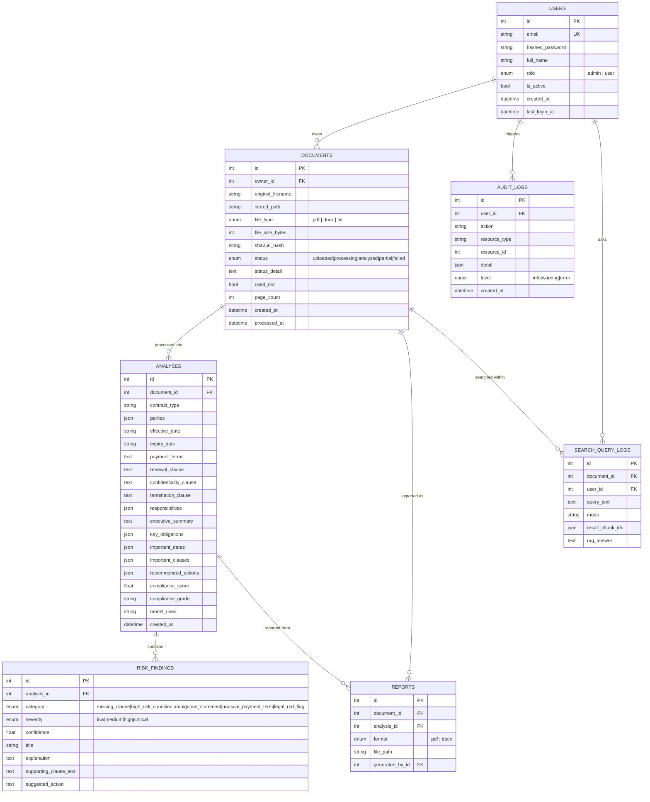

# Database Schema

SQLite via SQLAlchemy 2.0 async ORM (`aiosqlite`). Tables created via `Base.metadata.create_all`
on startup — no migration history needed for this greenfield, single-environment scope
(documented tradeoff vs. Alembic).

## Which columns feed which feature

| Feature | Query |
|---|---|
| Dashboard: total documents | `count(documents)` scoped by owner (or global for admin) |
| Dashboard: average compliance score | `avg(analyses.compliance_score)` over each document's **latest** analysis |
| Dashboard: high-risk document count | distinct documents whose latest analysis has ≥1 `risk_finding` with severity `high`/`critical` |
| Dashboard: frequently detected risks | `group by risk_findings.category, count(*)` across latest analyses, ordered desc |
| Dashboard / Documents: processing history | `documents` ordered by `created_at desc`, joined to latest `analyses` |
| Admin: system stats | counts across `users`/`documents`/`analyses`, `documents_by_status` group-by, `avg(processed_at - created_at)` for processing time, `groq_client_service.total_calls` (in-process counter) for Groq usage |
| Admin: audit log / system logs | `audit_logs` ordered by `created_at desc`, filterable by `level` |
| Document history | `documents.analyses` relationship (one row per processing run — supports reprocessing without losing prior results) |

`Document.latest_analysis` is a Python property (`analyses[0]` given the relationship is
ordered `Analysis.created_at.desc()`), not a separate column — reprocessing a document appends
a new `Analysis` row rather than overwriting the previous one, so history is preserved.
